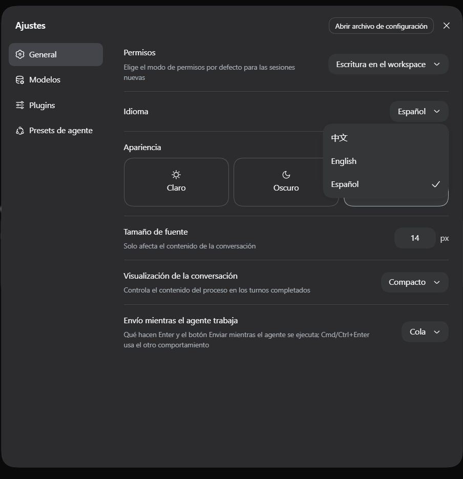

# dsh-locale-es

Español | [English](README.en.md) | [中文](README.zh.md)

[](https://dsh.fish/a/dsh-locale-es)

Paquete de idioma **español (es)** para la interfaz web de **DeepSeek Harness** —
un plugin de cliente de la comunidad que agrega **Español** a
*Ajustes → General → Idioma*.

No modifica `node_modules` ni el código de DeepSeek Harness. Se registra a través
del sistema oficial de localización (`@deepseek-ai/dsh-client-locale`), y las
claves sin traducir caen al inglés automáticamente.

> **¿Cómo poner DeepSeek Harness en español?** Instalá este pack y elegí **Español**
> en *Ajustes → General → Idioma*: traduce la interfaz web completa sin tocar la
> instalación de DSH.

## Versiones verificadas

| Componente | Versión |
|---|---|
| DeepSeek Harness (`@deepseek-ai/*`) | **0.1.6-alpha.1** |
| Node.js | **≥ 22** (probado en 24) |

### Compatibilidad

Una sola versión del pack sirve para varias versiones de DSH: el diccionario es la
unión de los namespaces que alguna versión leyó, lo que sobra se ignora y lo que falta
cae al inglés.

| Pack | DSH |
|---|---|
| 0.1.2 | 0.1.5-rc.1 → 0.1.6-alpha.1 |
| 0.1.1 | 0.1.5-rc.1 → 0.1.5-rc.2 |

Actualizar DSH no obliga a reinstalar el pack; ver [Actualizar el pack](#actualizar-el-pack).


> DSH está en *developer preview* y tiene cambios que rompen compatibilidad. Este pack
> solo usa el API público del registro de locale (`ctx.locale.addLanguage` /
> `ctx.locale.register`), así que las actualizaciones de DSH no exigen cambios de
> código: solo agregar las claves nuevas (ver [Desarrollo](#desarrollo)).

### Si instalás DSH globalmente

```sh
npm install -g @deepseek-ai/dsh@0.1.6-alpha.1
```

**No uses `@latest`**: en el registro de npm ese tag apunta a `0.1.5-rc.1`, anterior a
la versión contra la que se probó este pack; el tag `alpha` apunta a `0.1.6-alpha.1`.
Es normal que `dsh --version` difiera de la versión de los paquetes `@deepseek-ai/*` — el
CLI y los paquetes se publican por separado.

## Instalación

> [!WARNING]
> **No instales este paquete con `npm install`.** No es una librería autónoma: es un plugin
> de DSH. `npm i dsh-locale-es` lo deja en el directorio donde estés parado, baja peer
> dependencies de más y DSH nunca lo carga, así que seguirías viendo la interfaz en inglés.
> La instalación correcta es la de abajo, y es una sola línea.

```sh
dsh plugin --profile web add dsh-locale-es
```

El paquete está publicado en npm, así que esa ruta instala la última versión publicada. Para
fijar un commit concreto (por ejemplo, para probar un cambio sin publicar):

```sh
dsh plugin --profile web add github:GuidoMaxier/dsh-locale-es#<commit>
```

Reiniciá DSH y elegí **Español** en *Ajustes → General → Idioma*.

## Actualizar el pack

El profile fija la instalación en su `pnpm-lock.yaml`: una versión nueva **no llega sola**.
Si instalaste desde npm, el lock fija la versión publicada; si instalaste desde GitHub, fija
un commit. En los dos casos:

```sh
dsh plugin --profile web update
```

Reiniciá DSH después. `dsh plugin` es un pasamanos de pnpm
([`apps/cli/src/plugin.ts`](https://github.com/deepseek-ai/deepseek-harness/blob/master/apps/cli/src/plugin.ts)):
`update` vuelve a resolver la dependencia y después reconcilia `dsh.profile.bundles`
contra lo instalado, así que **no hace falta desinstalar y volver a instalar**.

Actualizar **DSH** no requiere nada de esto. El profile no instala sus propios
paquetes del harness: los enlaza por symlink a la instalación global
(`~/.dsh/profiles/node_modules/@deepseek-ai/*` → la instalación de npm), así que al
subir de versión DSH el pack sigue cargando sin tocar nada.

> Por qué no hay `peerDependencies` sobre `@deepseek-ai/dsh-client-locale`: node-semver
> solo acepta un prerelease si el rango nombra ese mismo `major.minor.patch`, así que
> `>=0.1.0-rc.6` **no** satisface a `0.1.6-alpha.1`. La versión verificada está en la tabla
> de arriba; el pack solo usa el API público del registro de locale
> (`ctx.locale.addLanguage` / `ctx.locale.register`).

## ¿Se puede usar pnpm en vez de npm?

**Para el pack no hay nada que elegir.** `dsh plugin` *es* un pasamanos de pnpm: ejecuta
`pnpm <args>` dentro del directorio del profile (`apps/cli/src/plugin.ts`). pnpm ya es lo
que gestiona los plugins del profile — solo necesita estar en el PATH.

**Para instalar DSH en sí, usá npm:**

```sh
npm install -g @deepseek-ai/dsh@0.1.6-alpha.1
```

Una instalación *global* de DSH con pnpm falla al arrancar con `ERR_MODULE_NOT_FOUND`:
DSH importa paquetes que no declara como dependencias, y pnpm solo le expone a cada
paquete sus dependencias declaradas — así que los módulos están en disco pero son
inaccesibles. El árbol plano de npm los resuelve. Comprobado en Windows / Node 24 con
pnpm 11.7.0, la versión que fija este repositorio.

## Desinstalar

```sh
dsh plugin --profile web remove dsh-locale-es
```

Reiniciá DSH y la interfaz vuelve al idioma anterior. Tu preferencia guardada
(`locale.preference` en `settings.yaml`) se conserva, así que si volvés a instalar el
pack el español se activa solo; borrala si querés que la elección vuelva a depender del
navegador.

## Cómo poner la interfaz en español

1. Abrí **Ajustes**.
2. Entrá en **General**.
3. En la fila **Idioma**, elegí **Español**.

La elección se guarda en el documento de ajustes de DSH y sobrevive reinicios del
servidor y del navegador. Si tu navegador ya está en español, DSH lo detecta y lo activa
sin que toques nada.

## Preguntas frecuentes

**¿Cómo pongo DeepSeek Harness en español?**
Instalá el pack, reiniciá DSH y elegí **Español** en *Ajustes → General → Idioma*. El
paso a paso está en [Instalación](#instalación).

**¿DSH viene con español de fábrica?**
No. La interfaz trae solo **English** y **中文**; el español llega con un paquete de
idioma como este.

**¿Traduce las respuestas del modelo?**
No, traduce la interfaz: menús, ajustes, botones y el texto visible de las herramientas.
El idioma de las respuestas y del razonamiento se pide por prompt o con otro plugin.

**¿En qué se diferencia de los plugins multilingües?**
Traduce un idioma a fondo: 1349 cadenas de la versión actual más 26 que las versiones
anteriores todavía leen, con una tabla de terminología revisada, en vez de repartir el
esfuerzo entre muchos idiomas.

**¿Funciona con mi versión de DSH?**
Cubre de 0.1.5-rc.1 a 0.1.6-alpha.1; ver [Compatibilidad](#compatibilidad).

**¿Se rompe algo al actualizar DSH?**
No. Las claves que esa versión no conoce se ignoran y las que faltan caen al inglés.

**¿Modifica la instalación de DSH?**
No toca `node_modules` ni el código de DeepSeek Harness: se registra por el API público
de localización.

## Capturas



Ver [`docs/screenshots/`](docs/screenshots/) para el resto.

## Reportar un error de traducción

Abrí un issue: <https://github.com/GuidoMaxier/dsh-locale-es/issues>

Incluí el namespace y la clave si los conocés (por ejemplo
`workspace.rename.session.title`), el texto que ves y tu propuesta, una captura, y tu
versión de DSH (`dsh --version`). Los textos se editan en `data/es-dictionaries.json`;
ver [Desarrollo](#desarrollo).

## Cobertura

- **44 namespaces · 1349 claves** de la versión actual de DSH — 1214 traducidas.
- **+26 claves legacy** en 5 namespaces que DSH ya no declara pero que 0.1.5 todavía
  lee, así que un usuario con `@latest` tampoco ve inglés nuevo.
- Cubre el shell y los ajustes (`settings`, `settings.models`, `settings.plugins`,
  `settings.agentPreset`, `settings.pluginInventory`, `permission.access`), chat
  y conversación (`chat`, `conversation`), `trajectory`, `workspace`, `subagent`,
  `workflowRun`, `cordis`, `deliverables`, `approval`, `plan`, `job`, `feedback`,
  `sidebar`, `common` y el resto.
- Las claves sin cubrir caen al inglés (`es` → `en`), que es el mecanismo oficial
  de DSH: una versión más nueva nunca rompe la interfaz.

## Cómo funciona

Un **plugin de cliente** de DSH normal, en dos mitades:

| Archivo | Rol |
|---|---|
| `index.js` | Mitad Host — vacía a propósito. JavaScript plano, sin build. |
| `lib/client.js` | Mitad navegador — generado, y **commiteado**; es lo que descarga el navegador. |
| `cordis.patch.yml` | Capa de perfil que monta el plugin como fila del loader. |
| `data/es-dictionaries.json` | Fuente de verdad de la traducción. |
| `data/en-dictionaries.json` | Generado: el corpus inglés extraído de un checkout de DSH. |
| `data/legacy-dictionaries.json` | Claves que upstream quitó y una versión anterior de DSH todavía lee. |
| `data/patches/*.json` | Lotes de traducción, aplicados en orden. |
| `data/terminology.json` | Sustituciones de frase que mantienen las etiquetas cortas. |
| `tools/*.ts` | Scripts de extracción, build, sincronización, control y progreso. |

### El protocolo del bundle

`lib/client.js` **no** es ESM plano. `client-modules` compone un único bundle con
todos los plugins de cliente, y cada módulo se registra a sí mismo:

```js
window.__ModuleLoader__.load({
  id: "dsh-locale-es",
  factory: () => {
    const module = { exports: {} }
    exports.inject = ["locale"]
    exports.apply = function apply(ctx) { /* … */ }
    return module.exports
  },
})
```

Un bundle que solo exporta símbolos ESM **carga sin registrarse**, y el loader
reporta el error contra **otro** plugin, porque el conteo de registros se
desalinea. `tools/build-client.ts` emite la forma correcta.

## Desarrollo

Los scripts necesitan `tsx` de un checkout de DeepSeek Harness, así que corren ahí:

```sh
# Re-extraer el corpus inglés de un checkout actualizado
node --import tsx/esm tools/extract-dictionaries.ts <repo-root> data/en-dictionaries.json

# Traer las claves nuevas sin pisar lo traducido (se siembran en inglés)
# Mueve a legacy las claves que upstream elimina en vez de descartarlas.
node --import tsx/esm tools/sync-es.ts data/en-dictionaries.json data/es-dictionaries.json \
  data/legacy-dictionaries.json

# Aplicar un lote de traducción (reemplaza solo claves existentes)
node --import tsx/esm tools/apply-patch.ts data/es-dictionaries.json data/patches/38-nuevo.json

# Regenerar el bundle — commitear el resultado
node --import tsx/esm tools/build-client.ts data/es-dictionaries.json lib/client.js

# Qué falta todavía
node --import tsx/esm tools/report-progress.ts data/en-dictionaries.json data/es-dictionaries.json
```

Para probar sin instalar, montá el pack como overlay. **`--patch` va antes de los
flags del app** (el subcomando `web` usa `passThroughOptions()`, así que un flag
del app primero corta el parseo del launcher):

```sh
pnpm dsh web --patch <repo>/cordis.patch.yml --no-open      # correcto
pnpm dsh web --no-open --patch <repo>/cordis.patch.yml      # error: unknown option
```

Si el pack ya está instalado en el profile, el overlay falla con `duplicate loader
entry id: dsh-locale-es`. Quitalo antes (`dsh plugin --profile web remove
dsh-locale-es`) y volvé a instalarlo cuando termines.

## Terminología

- Los términos técnicos se quedan en inglés donde los desarrolladores hispanos ya
  los usan: **workspace, plugin, prompt, shell, token, timeline, tool calls**.
- Los tokens de comando (`compact`, `export`, `plan`…) no se traducen nunca: son lo
  que se escribe en la línea de comandos.
- Las etiquetas se mantienen cortas a propósito. El español es más largo que el
  inglés y los elementos de ancho fijo (botones, chips, filas del sidebar) tienen
  poco espacio; la tabla `terminology.json` es el registro revisado de esas
  decisiones.

## Lo que el registro de locale no puede traducir

- **Identificadores de presets de permisos** (`Read Only`, `Workspace Write`,
  `Full access`) — el core los define sin nombres para mostrar.
- **Nombres de herramientas** (`Bash`, `Read`, `Write`, …) — identificadores técnicos.
- La salida del modelo, las rutas de archivos y otros datos, obviamente.

## Créditos

**Hernán Casasola** — [LinkedIn](https://www.linkedin.com/in/hernan-casasola) ·
GitHub [@GuidoMaxier](https://github.com/GuidoMaxier)

## Licencia y aviso

MIT. Proyecto no oficial de la comunidad, desarrollado y mantenido de forma
independiente; no fue revisado ni respaldado por DeepSeek.
